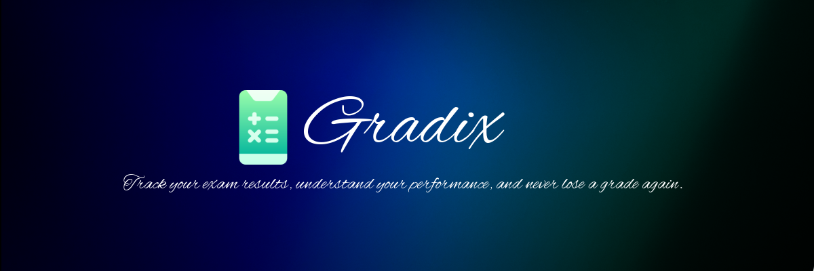

<div align="center">



<br/>
<br/>

[](https://gradix-tau.vercel.app/)
&nbsp;
[](#)
&nbsp;
[](#)

<br/>

*Track your exam results, understand your performance, and never lose a grade again.*

<sub>An app by Ayan Rashid</sub>

</div>

---

> [!NOTE]
> After opening the web app, you can use the "Add to Home Screen" or "Install as an app" option to access Gradix anytime from your home screen — no install required.

---

## Overview

Most students lose track of their results across exams and never see the full picture of how they're performing. Gradix fixes that.

It's a personal result calculator and journal — log your subjects, enter your marks, and instantly get your percentage, letter grade, and pass/fail status. Save multiple results across different exams and look back at how you've improved over time.

No accounts. No cloud. No tracking. Everything lives on your device.

---

> [!WARNING]
> Gradix uses localStorage — your saved results remain tied to the browser you use. Clearing browser data will erase them.

---

## Features

- **Result Calculator** — Enter marks for each subject and get your overall percentage instantly
- **Per-Subject Breakdown** — Individual percentage, grade, and a visual progress bar for every subject
- **Grading Scale** — Automatic A+, A, B, C, D, E, F grading using the standard Pakistani grading system
- **Pass / Fail Detection** — Flags a fail if any single subject or the overall score drops below 40%
- **Multiple Saved Results** — Store and name results for different exams (Mid Term, Finals, Unit Tests)
- **Edit & Delete** — Update any saved result or remove it with a confirmation prompt
- **Inline Rename** — Rename a result directly from the detail view
- **Mobile-First** — Designed for one hand. Feels native on iOS and Android. Works offline
- **Fully Private** — All data is stored locally in your browser. Nothing leaves your device

---

## Grading Scale

| Percentage | Grade |
|---|---|
| 90 – 100% | A+ |
| 80 – 89% | A |
| 70 – 79% | B |
| 60 – 69% | C |
| 50 – 59% | D |
| 40 – 49% | E |
| Below 40% | F (Fail) |

---

## Design

Gradix draws from fintech dashboard aesthetics — deep navy gradients, glassmorphism cards, and a single electric blue accent — to feel polished and premium rather than like a generic school tool.

| Token | Value |
|---|---|
| Background | `#040810` |
| Surface | `rgba(255,255,255,0.04)` |
| Accent | `#4f9eff` |
| Headline font | Sora |
| UI font | Outfit |

Full design reference in [`docs/DESIGN.md`](docs/DESIGN.md).

---

## Tech

A single HTML file. No frameworks, no bundler, no build step, no backend.

| | |
|---|---|
| Language | Vanilla HTML / CSS / JS |
| Storage | `localStorage` — fully offline |
| Dependencies | None |
| Bundle size | One file |

---

## Project Structure

```
gradix/
├── index.html              # The entire application
├── assets/
│   ├── logo.png            # App logo
│   └── banner.png          # Banner image
├── docs/
│   ├── DESIGN.md           # Visual language & design decisions
│   └── ROADMAP.md          # Planned features
├── CHANGELOG.md            # Version history
├── .gitignore
└── README.md
```

---

## Deployment

Gradix is a static file — it deploys anywhere in seconds.

### Vercel (recommended)
1. Import the repo at [vercel.com/new](https://vercel.com/new)
2. Framework preset: **Other**
3. Click **Deploy**

### Netlify
Drag and drop the project folder at [netlify.com/drop](https://app.netlify.com/drop). Done.

### Any static host
Upload `index.html` to any web server or CDN. That's all that's needed.

---

## Roadmap

See [`docs/ROADMAP.md`](docs/ROADMAP.md) for the full list. Near-term:

- [ ] Export results as PDF or image (shareable report card)
- [ ] Full-text search across saved results
- [ ] Target grade calculator (what marks do I need?)
- [ ] Light theme
- [ ] Optional cloud sync

---

## License

Private repository. Not licensed for public use or redistribution.

---

<div align="center">

[Open Gradix →](https://gradix-tau.vercel.app/)

</div>
